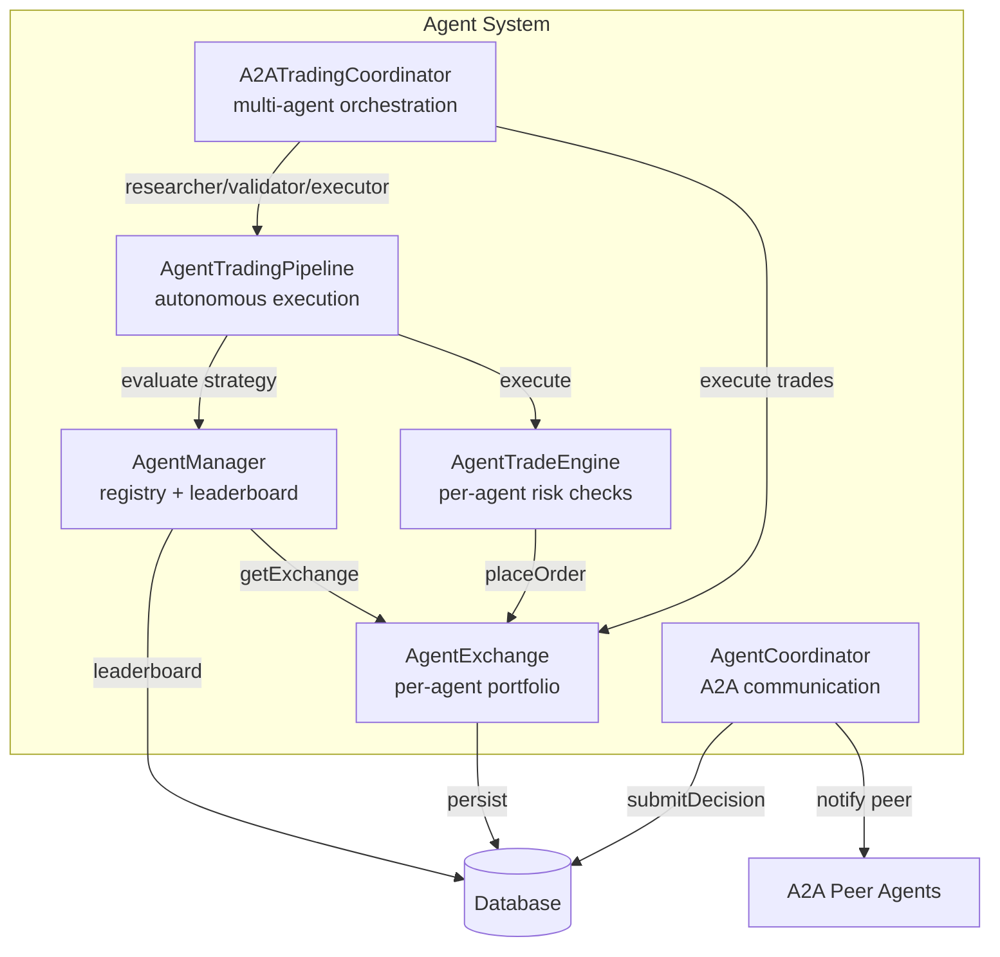
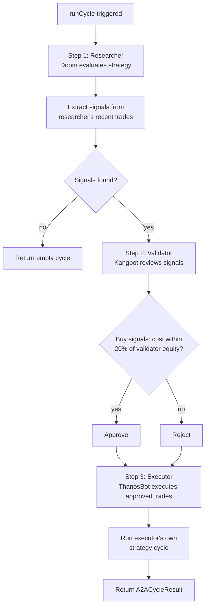
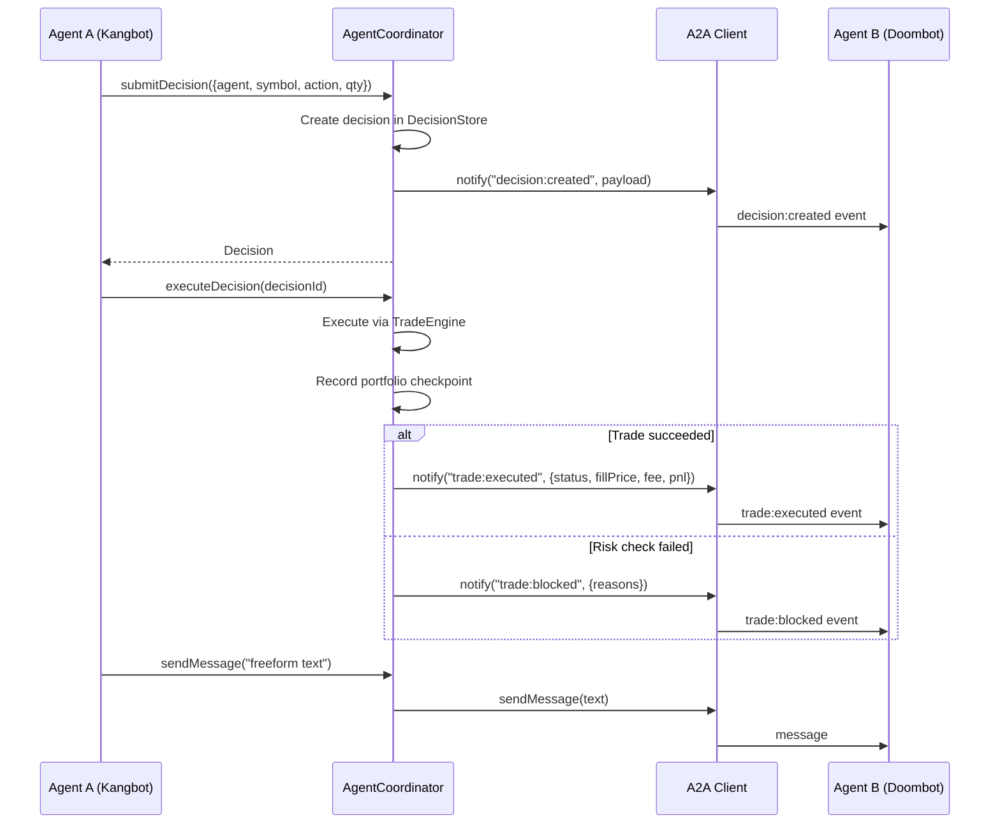
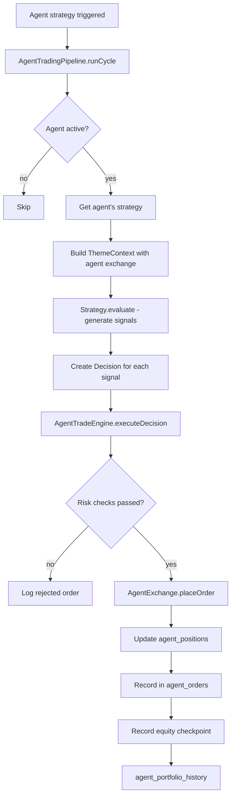

# Agent System

> Per-agent trading with independent portfolios, risk management, and autonomous strategy execution. Each agent trades with its own balance, positions, and risk limits — completely isolated from other agents.

## Overview

DoomTrade's Agent System enables multiple AI agents to trade simultaneously with independent portfolios. Each agent has its own balance, positions, trade history, assigned strategy, and per-agent risk checks. Agents can communicate via the A2A (Agent-to-Agent) protocol.



## Core Components

### AgentManager (`src/agent/agent-manager.ts`)

Registry and lifecycle management for trading agents. Each agent has its own `AgentExchange` (portfolio), strategy, and starting balance.

**Key methods**:
- `register(name, {startingBalance, strategy})` — Create a new agent. Throws if name exists.
- `getOrCreate(name)` — Get agent by name, auto-provision if not found.
- `getByName(name)` / `getById(id)` — Look up agents.
- `list()` — All agents with portfolio summaries (cash, equity, totalReturnPct, openPositions).
- `leaderboard()` — Agents ranked by total return % (descending).
- `setStrategy(agentId, strategy)` — Assign a strategy.
- `deactivate(agentId)` — Deactivate an agent.
- `seedDefaults(agents[])` — Pre-seed agents on boot.
- `getExchange(agentId)` — Returns cached `AgentExchange` instance.

**Agent type**:
```typescript
interface Agent {
  id: string;
  name: string;          // Unique
  startingBalance: number;
  strategy: string | null; // Strategy type name
  active: boolean;
  createdAt: string;
}
```

### AgentExchange (`src/executor/agent-exchange.ts`)

Per-agent executor with independent balance, positions, and orders. Implements the same `Executor` interface as `SimulatedExchange`.

- **Balance**: `agent_balance` table (cash, initial_cash, peak_equity). Singleton per agent.
- **Positions**: `agent_positions` table (per-agent, per-symbol). Long-only (no short selling).
- **Orders**: `agent_orders` table with fill price, fee, realized P&L, status.
- **Equity history**: `agent_portfolio_history` table — checkpoints recorded after each trade.

**Key methods**:
- `placeOrder(order)` — Validate position (long-only), compute fill price, deduct fees, update position, record order.
- `getBalance()` — Returns `{cash, equity, initialCash, peakEquity}`. Equity = cash + positions market value.
- `getPositions()` — Open positions with unrealized P&L.
- `recordCheckpoint()` — Persist equity snapshot to `agent_portfolio_history`.
- `getTrades(limit)` — Trade history from `agent_orders`.

### AgentTradeEngine (`src/engine/agent-trade-engine.ts`)

Per-agent trade execution with risk checks scoped to the agent's own equity — not a shared pool.

**Risk checks** (all scoped per-agent):
1. **Max open positions**: Agent's position count must be under `MAX_OPEN_POSITIONS`
2. **Max position size**: Order notional must not exceed `MAX_POSITION_SIZE_PCT` of agent's equity
3. **Daily trade limit**: Agent's non-rejected orders today must be under `DAILY_TRADE_LIMIT` (counts `agent_orders`)
4. **Max drawdown**: Agent's drawdown from peak equity must be under `MAX_DRAWDOWN_PCT`

**Key methods**:
- `executeDecision({decision, agentId, orderType?, limitPrice?})` — Run risk checks → place order via AgentExchange → record checkpoint.
- `getTrades(agentId, limit, offset)` — Trade history.
- `getPositions(agentId)` — Open positions.
- `getPortfolio(agentId)` — Full portfolio snapshot with P&L.
- `getAnalytics(agentId)` — Performance analytics.

**Portfolio snapshot**:
```typescript
{
  cash: number;
  equity: number;
  initialCash: number;
  peakEquity: number;
  positionsValue: number;
  unrealizedPnl: number;
  realizedPnl: number;
  totalReturnPct: number;
  positions: Position[];
}
```

**Analytics**:
```typescript
interface AgentAnalytics {
  totalTrades: number;
  wins: number;           // Sell trades with realized_pnl > 0
  losses: number;         // Sell trades with realized_pnl < 0
  winRate: number;        // wins / (wins + losses)
  totalPnl: number;       // Sum of all realized_pnl
  avgPnl: number;         // totalPnl / totalTrades
  sharpeRatio: number;    // Annualized (252 trading days)
  maxDrawdownPct: number; // From agent_portfolio_history
}
```

### AgentTradingPipeline (`src/agent/trading-pipeline.ts`)

Autonomous per-agent strategy execution. Runs on a schedule, evaluates each active agent's assigned strategy, generates signals, creates decisions, and executes trades.

**Constructor**:
```typescript
new AgentTradingPipeline({
  agentManager: AgentManager,
  marketData: MarketDataService,
  db: Database,
  strategies: Map<string, ThemeStrategy>,  // Strategy type → implementation
  defaultUniverse: string[],               // Default symbol universe
});
```

**`runCycle()`**: For each active agent, evaluates their assigned strategy, generates signals, creates decisions, and executes trades via AgentTradeEngine.

**`runAgentCycle(agentId, agentName, strategyType)`**: Evaluate a single agent. Ensures a theme row exists in the `themes` table (FK target for `theme_signals`), builds a `ThemeContext` with the agent's `AgentExchange` passed as `ctx.exchange`, and runs the strategy. Allocation limits set to 99% for per-agent trading (leaves room for fees).

**Default universe**: `["BTC/USDT", "ETH/USDT", "SOL/USDT", "XRP/USDT", "ADA/USDT", "DOGE/USDT", "AVAX/USDT"]`

### A2ATradingCoordinator (`src/integration/a2a-trading-coordinator.ts`)

Multi-agent orchestration with role-based trading flow. Coordinates three agents in a research-validate-execute pipeline.



**Roles** (configurable, defaults shown):
- **Researcher** (Doom): Evaluates assigned strategy, generates trade signals. Signals extracted from recent trades (last 5) or existing positions.
- **Validator** (Kangbot): Reviews each signal. Sells always approved (risk management). Buys approved if cost is within 20% of validator's equity. Holds always approved.
- **Executor** (ThanosBot): Executes approved trades via `AgentExchange.placeOrder()`, then runs its own strategy cycle.

**Key types**:
```typescript
interface A2ASignalMessage {
  symbol: string;
  action: "buy" | "sell" | "hold";
  suggestedQuantity?: number;
  priceAtSignal?: number;
  reason: string;
  confidence: number;
}

interface A2AValidationResult {
  symbol: string;
  action: "buy" | "sell" | "hold";
  approved: boolean;
  reason: string;
  adjustedQuantity?: number;
}

interface A2ACycleResult {
  researcher: string;
  validator: string;
  executor: string;
  signals: A2ASignalMessage[];
  validations: A2AValidationResult[];
  executedTrades: AgentTradeResult | null;
  researcherResult: AgentTradeResult | null;
  executorResult: AgentTradeResult | null;
  errors: string[];
}
```

**API**: `POST /api/agents/a2a-cycle` triggers a full cycle.

### AgentCoordinator (`src/integration/agent-integration.ts`)

A2A communication wrapper using `@cwdcwd/agent-bridge`.



**Key methods**:
- `submitDecision(input)` — Create decision in DecisionStore + notify peer via A2A (`decision:created` event).
- `executeDecision(decisionId, orderType?)` — Execute trade via TradeEngine + notify peer of outcome (`trade:executed` or `trade:blocked`).
- `getPortfolioStatus()` — Returns portfolio snapshot + P&L.
- `sendMessage(text)` — Freeform message to peer agent.

## Default Agents

Seeded on boot in `src/index.ts`:

| Agent | Strategy | Starting Balance | Description |
| --- | --- | --- | --- |
| Doom | momentum-rotation | $100,000 | Screens crypto universe for momentum signals, holds top 5 |
| Kangbot | congress-follower | $100,000 | Mirrors congressional trade disclosures (Bargo API) |
| ThanosBot | momentum-rotation | $100,000 | Screens crypto universe for momentum (was agent-driven) |

## Agent Trade Execution Flow



## Database Schema

```mermaid
erDiagram
    agents ||--|| agent_balance : "has one"
    agents ||--o{ agent_positions : "has many"
    agents ||--o{ agent_orders : "has many"
    agents ||--o{ agent_portfolio_history : "has many"

    agents {
        TEXT id PK
        TEXT name UK
        REAL starting_balance
        TEXT strategy
        INTEGER active
        TEXT created_at
    }

    agent_balance {
        TEXT agent_id PK FK
        REAL cash
        REAL initial_cash
        REAL peak_equity
        TEXT updated_at
    }

    agent_positions {
        TEXT agent_id PK_FK
        TEXT symbol PK
        REAL quantity
        REAL avg_entry_price
        TEXT side
        TEXT updated_at
    }

    agent_orders {
        TEXT id PK
        TEXT agent_id FK
        TEXT decision_id
        TEXT symbol
        TEXT side
        TEXT order_type
        REAL quantity
        REAL fill_price
        REAL fee
        REAL realized_pnl
        TEXT status
        TEXT error
        TEXT created_at
        TEXT filled_at
    }

    agent_portfolio_history {
        TEXT id PK
        TEXT agent_id FK
        TEXT timestamp
        REAL equity
        REAL cash
        REAL positions_value
        REAL unrealized_pnl
        REAL realized_pnl
    }
```

## Agent API Endpoints

All agent endpoints are under `/api/agents` and require authentication.

| Method | Path | Description |
| --- | --- | --- |
| GET | `/api/agents` | List all agents with portfolio summaries |
| POST | `/api/agents` | Register a new agent |
| GET | `/api/agents/:id` | Agent details |
| PATCH | `/api/agents/:id` | Update agent (strategy, active) |
| DELETE | `/api/agents/:id` | Deactivate agent |
| GET | `/api/agents/:id/portfolio` | Portfolio snapshot (cash, equity, positions, P&L) |
| GET | `/api/agents/:id/trades` | Trade history (query: limit, offset) |
| GET | `/api/agents/:id/positions` | Open positions |
| GET | `/api/agents/:id/analytics` | Performance analytics (win rate, Sharpe, drawdown) |
| GET | `/api/agents/leaderboard` | Ranked by total return % |
| POST | `/api/agents/:id/evaluate` | Run agent's assigned strategy once |
| POST | `/api/agents/a2a-cycle` | Run full multi-agent A2A trading cycle |
| POST | `/admin/reset` | Reset all sim data (requires `confirm: "WIPE_ALL_DATA"`) |

**Example: Get leaderboard**
```bash
curl http://localhost:3000/api/agents/leaderboard \
  -H "Authorization: Bearer YOUR_API_KEY"
```

**Example: Get agent analytics**
```bash
curl http://localhost:3000/api/agents/abc-123/analytics \
  -H "Authorization: Bearer YOUR_API_KEY"
```

**Example: Trigger strategy evaluation**
```bash
curl -X POST http://localhost:3000/api/agents/abc-123/evaluate \
  -H "Authorization: Bearer YOUR_API_KEY"
```

## Creating a Custom Agent

```bash
# Register a new agent via API
curl -X POST http://localhost:3000/api/agents \
  -H "Content-Type: application/json" \
  -H "Authorization: Bearer YOUR_API_KEY" \
  -d '{
    "name": "VisionBot",
    "startingBalance": 50000,
    "strategy": "momentum-rotation"
  }'

# Assign a strategy
curl -X PATCH http://localhost:3000/api/agents/abc-123 \
  -H "Content-Type: application/json" \
  -H "Authorization: Bearer YOUR_API_KEY" \
  -d '{"strategy": "congress-follower"}'

# Trigger evaluation
curl -X POST http://localhost:3000/api/agents/abc-123/evaluate \
  -H "Authorization: Bearer YOUR_API_KEY"
```

## Sharpe Ratio Calculation

The Sharpe ratio in `AgentTradeEngine.getAnalytics()` is calculated from sell-trade returns (closed positions):

```
returns = [realized_pnl for each sell trade]
avgReturn = mean(returns)
stdDev = sqrt(variance(returns))
sharpeRatio = (avgReturn / stdDev) * sqrt(252)
```

Annualized using 252 trading days (standard for stock markets). The current implementation uses 252 for both stock and crypto, even though crypto markets run 24/7 (where `sqrt(365)` would be more accurate).