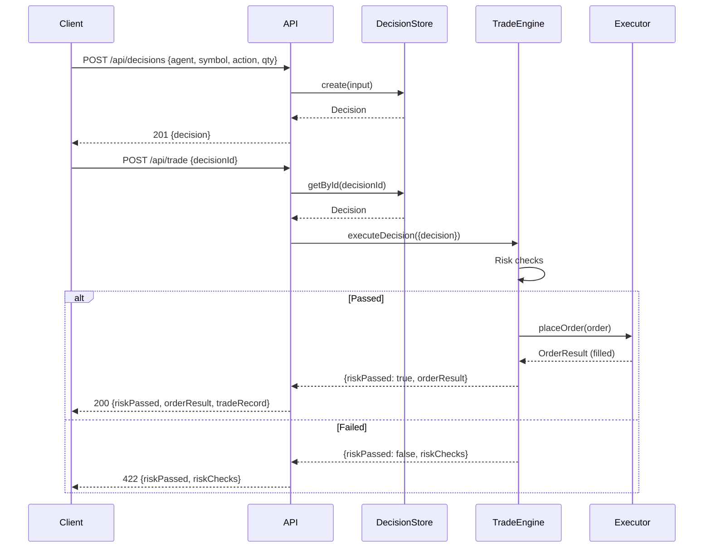

# DoomTrade API Reference

> Full REST API documentation. Base URL: `http://localhost:3000` (local) or `https://doomtrade-production.up.railway.app` (production). All endpoints under `/api`.

## Authentication

If `DOOMTRADE_API_KEY` environment variable is set, all requests (except `/api/health`) require authentication via one of:

```
Authorization: Bearer YOUR_API_KEY
X-API-Key: YOUR_API_KEY
```

If the env var is not set, authentication is disabled (local dev mode).

---

## Error Responses

All error responses follow a consistent JSON format:

```json
{
  "error": "Error type",
  "message": "Human-readable detail",
  "id": "optional resource id",
  "details": []
}
```

| Status | When | Example |
| --- | --- | --- |
| 400 | Zod validation failed | `{"error": "Validation failed", "details": [...]}` |
| 401 | Missing or invalid API key | `{"error": "Unauthorized", "message": "..."}` |
| 404 | Resource not found | `{"error": "Decision not found", "id": "uuid"}` |
| 422 | Risk check failed (trade execution) | `{"error": "...", "riskPassed": false, ...}` |
| 429 | Rate limited (mode cooldown) | `{"error": "Mode change cooldown active. 45s remaining."}` |
| 500 | Internal server error | `{"error": "Failed to create decision", "message": "..."}` |
| 503 | Service unavailable (market data) | `{"error": "Market data service not available"}` |

---

## Health

### GET /api/health

Returns server health status. Always public (no auth required).

**Response** `200`
```json
{
  "status": "ok",
  "mode": "sim",
  "timestamp": "2026-09-08T18:00:00.000Z",
  "uptime": 3600
}
```

```bash
curl http://localhost:3000/api/health
```

---

## Decisions

### POST /api/decisions

Create a new trading decision. Decisions are append-only (immutable after creation).

**Request Body**
| Field | Type | Required | Description |
| --- | --- | --- | --- |
| agent | string | yes | Agent name (any string) |
| symbol | string | yes | Trading symbol (e.g. "BTC/USDT", "AAPL") |
| action | "buy" \| "sell" \| "hold" | yes | Trade action |
| quantity | number | yes | Quantity to trade (must be positive) |
| priceAtDecision | number | yes | Price at time of decision (must be positive) |
| rationale | string | yes | Reasoning for the decision |
| confidence | number (1-10) | yes | Confidence level |
| mode | "sim" \| "live" | yes | Trading mode |
| marketContext | object | no | Free-form context (price, volume, indicators, news, notes) |

**Response** `201`
```json
{
  "mode": "sim",
  "decision": {
    "id": "uuid",
    "timestamp": "ISO-8601",
    "agent": "kangbot",
    "symbol": "BTC/USDT",
    "action": "buy",
    "quantity": 0.5,
    "priceAtDecision": 65000,
    "rationale": "Bullish RSI divergence",
    "confidence": 8,
    "mode": "sim",
    "marketContext": null
  }
}
```

```bash
curl -X POST http://localhost:3000/api/decisions \
  -H "Content-Type: application/json" \
  -H "Authorization: Bearer YOUR_API_KEY" \
  -d '{
    "agent": "kangbot",
    "symbol": "BTC/USDT",
    "action": "buy",
    "quantity": 0.5,
    "priceAtDecision": 65000,
    "rationale": "Bullish RSI divergence",
    "confidence": 8,
    "mode": "sim"
  }'
```

### GET /api/decisions

List decisions with optional filtering.

**Query Parameters**
| Param | Type | Default | Description |
| --- | --- | --- | --- |
| agent | string | - | Filter by agent name |
| symbol | string | - | Filter by symbol |
| action | "buy"\|"sell"\|"hold" | - | Filter by action |
| mode | "sim"\|"live" | - | Filter by mode |
| startDate | string | - | Filter from date (ISO-8601) |
| endDate | string | - | Filter to date (ISO-8601) |
| limit | number | 100 | Max results (1-1000) |
| offset | number | 0 | Pagination offset |

**Response** `200`
```json
{
  "mode": "sim",
  "decisions": [...],
  "total": 50,
  "count": 10
}
```

```bash
curl "http://localhost:3000/api/decisions?agent=kangbot&limit=10" \
  -H "Authorization: Bearer YOUR_API_KEY"
```

### GET /api/decisions/:id

Get a single decision by ID.

**Response** `200` — `{mode, decision}`
**Response** `404` — `{error: "Decision not found", id}`

```bash
curl http://localhost:3000/api/decisions/abc-123 \
  -H "Authorization: Bearer YOUR_API_KEY"
```

---

## Trade Execution

### POST /api/trade

Execute a previously created decision. Runs risk checks, places the order, and logs the trade.

**Request Body**
| Field | Type | Required | Description |
| --- | --- | --- | --- |
| decisionId | UUID | yes | ID of the decision to execute |
| orderType | "market"\|"limit"\|"stop" | no | Order type (default: "market") |
| limitPrice | number | no | Required for limit orders |
| stopPrice | number | no | Required for stop orders |

**Response** `200` (filled), `202` (pending), `422` (risk check failed)
```json
{
  "mode": "sim",
  "riskPassed": true,
  "riskChecks": [
    {"passed": true, "check": "maxOpenPositions"},
    {"passed": true, "check": "maxPositionSize"},
    {"passed": true, "check": "dailyTradeLimit"},
    {"passed": true, "check": "maxDrawdown"}
  ],
  "orderResult": {
    "id": "uuid",
    "symbol": "BTC/USDT",
    "side": "buy",
    "quantity": 0.5,
    "fillPrice": 65010,
    "status": "filled",
    "fee": 32.505,
    "realizedPnl": 0,
    "timestamp": "ISO-8601"
  },
  "tradeRecord": {
    "id": "uuid",
    "decisionId": "uuid",
    "symbol": "BTC/USDT",
    "side": "buy",
    "quantity": 0.5,
    "fillPrice": 65010,
    "status": "filled",
    "fee": 32.505,
    "realizedPnl": 0,
    "mode": "sim",
    "executor": "simulated",
    "error": null
  }
}
```

```bash
curl -X POST http://localhost:3000/api/trade \
  -H "Content-Type: application/json" \
  -H "Authorization: Bearer YOUR_API_KEY" \
  -d '{"decisionId": "abc-123", "orderType": "market"}'
```



---

## Trades

### GET /api/trades

List trades with optional filtering.

**Query Parameters**
| Param | Type | Default | Description |
| --- | --- | --- | --- |
| symbol | string | - | Filter by symbol |
| status | "pending"\|"filled"\|"cancelled"\|"rejected" | - | Filter by status |
| decisionId | string | - | Filter by decision ID |
| startDate | string | - | Filter from date (ISO-8601) |
| endDate | string | - | Filter to date (ISO-8601) |
| limit | number | 100 | Max results (1-1000) |
| offset | number | 0 | Pagination offset |

**Response** `200`
```json
{
  "mode": "sim",
  "trades": [...],
  "count": 10
}
```

```bash
curl "http://localhost:3000/api/trades?symbol=BTC/USDT&status=filled&limit=20" \
  -H "Authorization: Bearer YOUR_API_KEY"
```

### GET /api/trades/:id

Get a single trade by ID.

**Response** `200` — `{mode, trade}`
**Response** `404` — `{error: "Trade not found", id}`

### GET /api/trades/analytics

Get aggregated performance analytics from trade history and equity curve.

**Query Parameters**
| Param | Type | Default | Description |
| --- | --- | --- | --- |
| symbol | string | - | Filter by symbol |
| startDate | string | - | Filter from date |
| endDate | string | - | Filter to date |

**Response** `200`
```json
{
  "mode": "sim",
  "analytics": {
    "totalTrades": 25,
    "wins": 12,
    "losses": 8,
    "winRate": 0.6,
    "avgReturn": 45.5,
    "totalPnl": 1500.00,
    "sharpeRatio": 1.85,
    "maxDrawdownPct": 8.5
  }
}
```

```bash
curl "http://localhost:3000/api/trades/analytics?symbol=BTC/USDT" \
  -H "Authorization: Bearer YOUR_API_KEY"
```

---

## Portfolio

### GET /api/portfolio

Get current portfolio snapshot with P&L breakdown.

**Response** `200`
```json
{
  "mode": "sim",
  "portfolio": {
    "equity": 105000,
    "cash": 80000,
    "positionsValue": 25000,
    "positions": [...],
    "exposurePct": 23.81,
    "positionCount": 3,
    "mode": "sim",
    "timestamp": "ISO-8601"
  },
  "pnl": {
    "unrealized": 2500,
    "realized": 1000,
    "total": 3500,
    "totalPct": 3.5,
    "unrealizedPct": 2.38
  }
}
```

### GET /api/portfolio/history

Get equity curve history.

**Query Parameters**
| Param | Type | Default | Description |
| --- | --- | --- | --- |
| startDate | string | - | Filter from date |
| endDate | string | - | Filter to date |
| limit | number | 1000 | Max results (1-10000) |

**Response** `200`
```json
{
  "mode": "sim",
  "history": [
    {
      "timestamp": "ISO-8601",
      "equity": 100000,
      "cash": 100000,
      "positionsValue": 0,
      "unrealizedPnl": 0,
      "realizedPnl": 0
    }
  ],
  "count": 50
}
```

### GET /api/positions

Get all open positions.

**Response** `200`
```json
{
  "mode": "sim",
  "positions": [
    {
      "symbol": "BTC/USDT",
      "quantity": 0.5,
      "avgEntryPrice": 65000,
      "side": "long",
      "unrealizedPnl": 500,
      "marketValue": 32500
    }
  ],
  "count": 1
}
```

---

## Market Data

### GET /api/market/quote?symbol=BTC/USDT

Get a current price quote. Auto-routes to Alpaca (stocks) or CCXT (crypto) based on symbol format.

**Response** `200`
```json
{
  "mode": "sim",
  "quote": {
    "symbol": "BTC/USDT",
    "price": 65000,
    "bid": 64995,
    "ask": 65005,
    "timestamp": "ISO-8601",
    "source": "ccxt"
  }
}
```

```bash
curl "http://localhost:3000/api/market/quote?symbol=AAPL" \
  -H "Authorization: Bearer YOUR_API_KEY"
```

### GET /api/market/bars?symbol=BTC/USDT&timeframe=1Day&range=3m

Get OHLCV bar data.

**Query Parameters**
| Param | Type | Default | Description |
| --- | --- | --- | --- |
| symbol | string | required | Trading symbol |
| timeframe | "1Min"\|"5Min"\|"15Min"\|"1Hour"\|"1Day" | "1Day" | Bar timeframe |
| range | string | "1m" | Range (e.g. "3m", "6m", "1y") |

**Response** `200`
```json
{
  "mode": "sim",
  "bars": [
    {
      "symbol": "BTC/USDT",
      "timestamp": "ISO-8601",
      "open": 64000, "high": 66000,
      "low": 63500, "close": 65000,
      "volume": 1234.5,
      "source": "ccxt"
    }
  ],
  "count": 90
}
```

### GET /api/market/snapshot?symbols=AAPL,BTC/USDT

Get price snapshots for multiple symbols.

**Response** `200`
```json
{
  "mode": "sim",
  "snapshots": [
    {"symbol": "AAPL", "price": 185.50, "timestamp": "...", "source": "alpaca"},
    {"symbol": "BTC/USDT", "price": 65000, "timestamp": "...", "source": "ccxt"}
  ],
  "count": 2
}
```

---

## Research

### GET /api/research/analyze?symbol=BTC/USDT&timeframe=1Day&range=6m

Get technical analysis with indicators and signals.

**Response** `200`
```json
{
  "mode": "sim",
  "analysis": {
    "symbol": "BTC/USDT",
    "timeframe": "1Day",
    "range": "6m",
    "barCount": 180,
    "lastPrice": 65000,
    "indicators": {
      "sma20": 63000,
      "sma50": 61000,
      "rsi14": 55.5
    },
    "signals": {
      "smaCrossover": "buy",
      "rsi": "neutral",
      "combined": "buy"
    },
    "summary": "BTC/USDT at $65000.00, SMA20=$63000.00, SMA50=$61000.00, RSI14=55.5, Golden cross (SMA20 above SMA50), Signal: BUY",
    "timestamp": "ISO-8601"
  }
}
```

```bash
curl "http://localhost:3000/api/research/analyze?symbol=BTC/USDT&range=6m" \
  -H "Authorization: Bearer YOUR_API_KEY"
```

---

## Mode Toggle

### POST /api/mode

Switch between sim and live mode. 60-second cooldown enforced.

**Request Body**
| Field | Type | Required | Description |
| --- | --- | --- | --- |
| mode | "sim" \| "live" | yes | Target mode |
| confirm | boolean | no | Required true for live mode |

**Response** `200`
```json
{
  "mode": "live",
  "previousMode": "sim",
  "message": "⚠️ LIVE mode active — real orders will be placed",
  "timestamp": "ISO-8601"
}
```

**Response** `429` — cooldown active
**Response** `400` — switching to live without `confirm: true`

```bash
curl -X POST http://localhost:3000/api/mode \
  -H "Content-Type: application/json" \
  -H "Authorization: Bearer YOUR_API_KEY" \
  -d '{"mode": "live", "confirm": true}'
```

---

## Themes

### GET /api/themes

List all themes.

**Query Parameters**
| Param | Type | Description |
| --- | --- | --- |
| strategy | string | Filter by strategy type |
| enabled | "true"\|"false" | Filter by enabled state |

**Response** `200` — `{mode, themes[], count}`

### POST /api/themes

Create a new theme.

**Request Body**
| Field | Type | Default | Description |
| --- | --- | --- | --- |
| name | string | required | Theme name |
| strategy | string | required | Strategy type |
| mode | "sim"\|"live" | "sim" | Trading mode |
| schedule | object | required | {type: "cron"\|"interval"\|"manual", expression?, milliseconds?} |
| maxAllocationPct | number | 5 | Max allocation per position (%) |
| maxTotalAllocationPct | number | 40 | Max total allocation (%) |
| maxPositions | number | 10 | Max concurrent positions |
| allocatedCapital | number | 0 | Allocated capital |
| params | object | {} | Strategy-specific parameters |
| enabled | boolean | true | Enable on creation |

**Response** `201` — `{mode, theme}`

```bash
curl -X POST http://localhost:3000/api/themes \
  -H "Content-Type: application/json" \
  -H "Authorization: Bearer YOUR_API_KEY" \
  -d '{
    "name": "Pelosi Tracker",
    "strategy": "congress-follower",
    "mode": "sim",
    "schedule": {"type": "interval", "milliseconds": 3600000},
    "params": {"politician": "Pelosi", "mirrorAction": "buys-only"},
    "enabled": true
  }'
```

### GET /api/themes/:id — Get theme details
### PATCH /api/themes/:id — Update theme
### DELETE /api/themes/:id — Delete theme (stops runner first)
### POST /api/themes/:id/evaluate — Run strategy once
### GET /api/themes/:id/evaluations?limit=50 — Evaluation history
### GET /api/themes/:id/performance — Theme performance metrics

---

## Agents

### GET /api/agents

List all agents with portfolio summaries.

**Response** `200`
```json
{
  "mode": "sim",
  "agents": [
    {
      "id": "uuid",
      "name": "Doom",
      "strategy": "momentum-rotation",
      "active": true,
      "cash": 95000,
      "equity": 102000,
      "initialBalance": 100000,
      "totalReturnPct": 2.0,
      "openPositions": 3,
      "createdAt": "ISO-8601"
    }
  ],
  "count": 3
}
```

### GET /api/agents/:id — Agent details
### GET /api/agents/:id/portfolio — Portfolio snapshot
### GET /api/agents/:id/trades?limit=100&offset=0 — Trade history
### GET /api/agents/:id/positions — Open positions
### GET /api/agents/:id/analytics — Performance analytics

**Analytics Response** `200`
```json
{
  "mode": "sim",
  "analytics": {
    "totalTrades": 25,
    "wins": 12,
    "losses": 8,
    "winRate": 0.6,
    "totalPnl": 1500.00,
    "avgPnl": 60.00,
    "sharpeRatio": 1.85,
    "maxDrawdownPct": 8.5
  }
}
```

### GET /api/agents/leaderboard

Get agents ranked by total return percentage (descending).

**Response** `200`
```json
{
  "mode": "sim",
  "leaderboard": [
    {
      "id": "uuid",
      "name": "Doom",
      "strategy": "momentum-rotation",
      "equity": 105000,
      "initialBalance": 100000,
      "totalReturnPct": 5.0,
      "totalReturn": 5000,
      "rank": 1
    }
  ]
}
```

### POST /api/agents/:id/evaluate

Run the agent's assigned strategy once. Returns signals, trades, equity before/after, and P&L change.

**Response** `200`
```json
{
  "agentId": "uuid",
  "agentName": "Doom",
  "strategy": "momentum-rotation",
  "signals": [...],
  "trades": [...],
  "errors": [],
  "equityBefore": 100000,
  "equityAfter": 102500,
  "pnlChange": 2500
}
```

### POST /api/agents

Register a new agent.

**Request Body**: `{name: string, startingBalance?: number, strategy?: string}`

### PATCH /api/agents/:id

Update an agent's strategy or active status.

**Request Body**: `{strategy?: string, active?: boolean}`

### DELETE /api/agents/:id

Deactivate an agent (sets `active = 0`).

### POST /api/agents/a2a-cycle

Run a full multi-agent A2A trading cycle (researcher -> validator -> executor).

**Response** `200`
```json
{
  "researcher": "Doom",
  "validator": "Kangbot",
  "executor": "ThanosBot",
  "signals": [...],
  "validations": [...],
  "researcherResult": {...},
  "executorResult": {...},
  "errors": []
}
```

### POST /admin/reset

Reset all sim data. Requires confirmation.

**Request Body**: `{"confirm": "WIPE_ALL_DATA"}`