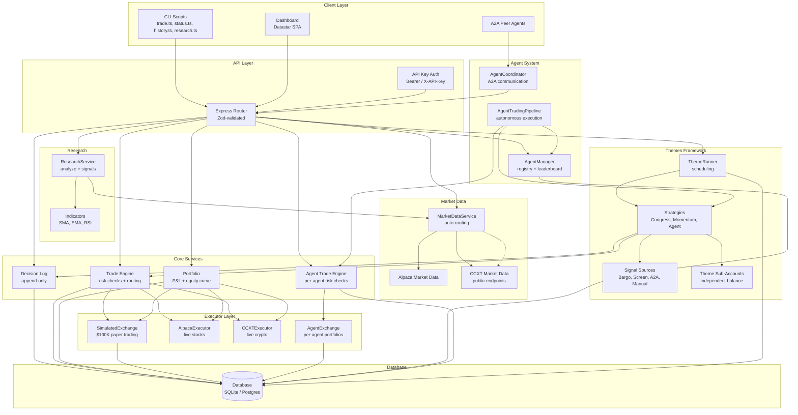
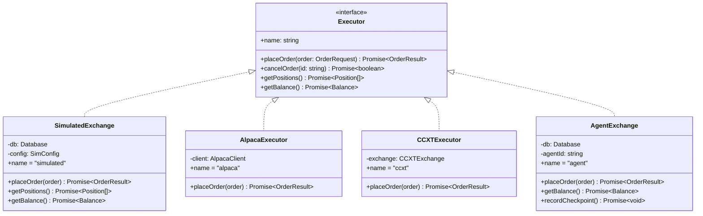
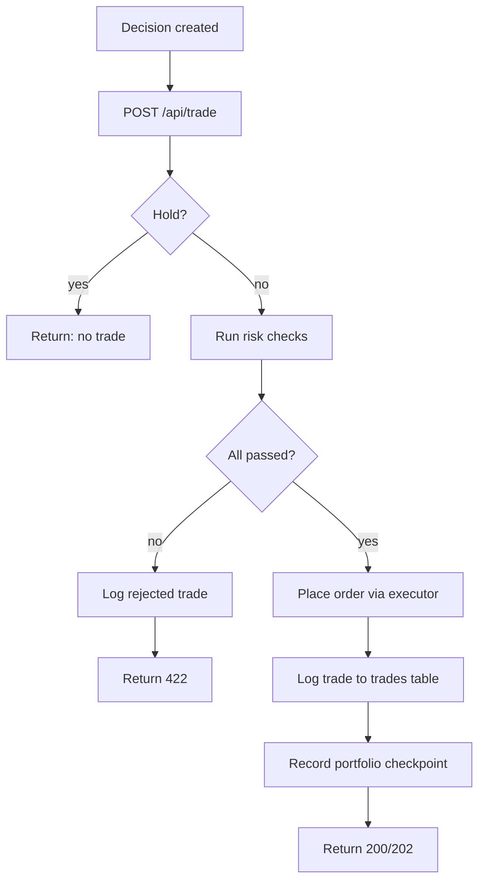
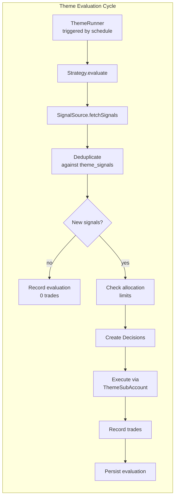
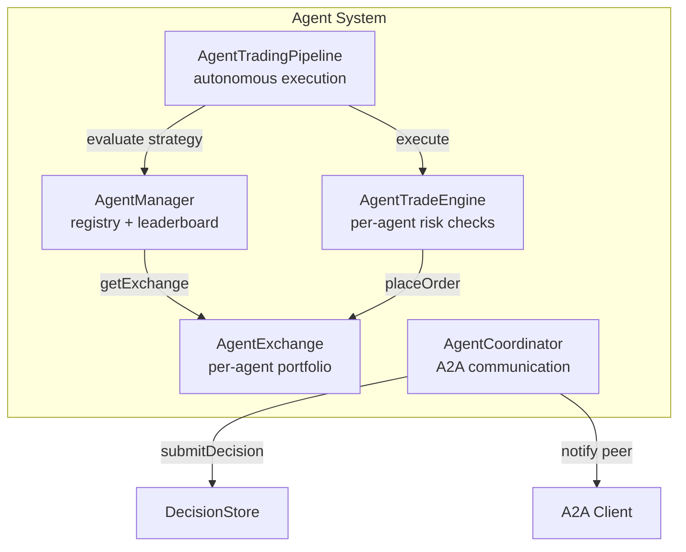
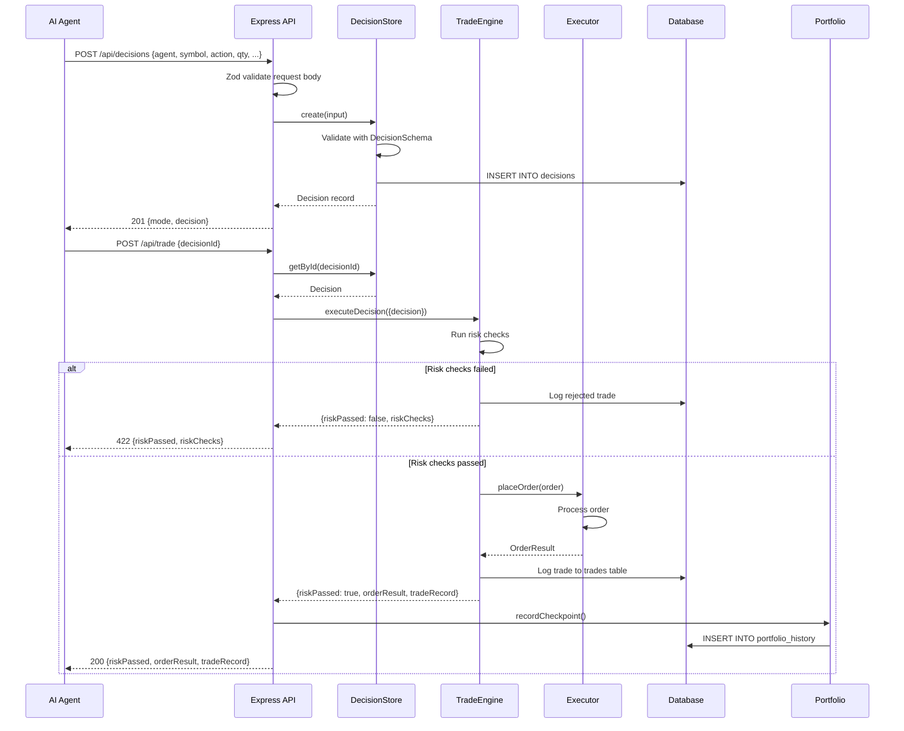

# DoomTrade Architecture

> System architecture for the agent-managed trading platform. This document describes all subsystems, their relationships, and the trade execution flow.

## Overview

DoomTrade is a TypeScript/Node.js Express application that enables AI agents to trade stocks and crypto with independent portfolios, risk-managed execution, and automated strategies. It runs in **sim mode** (paper trading with $100K virtual balance) or **live mode** (real orders via Alpaca for stocks, CCXT for crypto).

## Subsystem Details

### 1. Database Layer (`src/db/`)

Dual-mode abstraction supporting SQLite (sql.js / WASM) for local development and Postgres (`pg`) for production. All query helpers are async to work with both backends.

- **`DbClient` interface**: `run(sql, params)`, `exec(sql)`, `all<T>(sql, params)`, `get<T>(sql, params)`
- **8 idempotent migrations** tracked in `_migrations` table, applied in version order on boot
- **`{now}` placeholder**: converts to `datetime('now')` for SQLite, `NOW()` for Postgres
- **`convertPlaceholders()`**: converts `?` to `$1, $2, ...` for Postgres (skips `?` inside string literals)
- **SQLite persistence**: in-memory DB saved to disk on SIGINT/SIGTERM via `persistDatabase()`
- **Postgres**: connection via `Pool`, auto-persists. Activated when `DATABASE_URL` is set.

**Key files**: `database.ts` (interface + SQLite impl + migrations), `postgres.ts` (Postgres adapter)

### 2. Configuration (`src/config.ts`)

Zod-validated environment variable loading. Invalid config crashes at startup (fail-fast).

| Variable | Type | Default | Description |
| --- | --- | --- | --- |
| `PORT` | number | 3000 | Server port |
| `TRADE_MODE` | sim \| live | sim | Trading mode |
| `ALPACA_API_KEY_ID` | string | "" | Alpaca API key (stocks) |
| `ALPACA_API_SECRET_KEY` | string | "" | Alpaca API secret |
| `ALPACA_PAPER` | boolean | true | Use Alpaca paper trading endpoint |
| `CCXT_EXCHANGE` | string | binance | CCXT exchange id |
| `CCXT_API_KEY` | string | "" | CCXT API key (crypto) |
| `CCXT_API_SECRET` | string | "" | CCXT API secret |
| `DATABASE_PATH` | string | ./data/doomtrade.db | SQLite file path |
| `DATABASE_URL` | string | "" | Postgres connection string (empty = SQLite) |
| `MAX_OPEN_POSITIONS` | number | 10 | Max concurrent positions |
| `MAX_POSITION_SIZE_PCT` | number | 20 | Max position size as % of equity |
| `DAILY_TRADE_LIMIT` | number | 20 | Max trades per day |
| `MAX_DRAWDOWN_PCT` | number | 15 | Max drawdown before blocking trades |
| `SIM_STARTING_BALANCE` | number | 100000 | Sim mode starting cash |
| `SIM_FEE_PCT` | number | 0.1 | Sim fee percentage (0.1 = 0.1%) |
| `REDIS_URL` | string | "" | Redis URL for BullMQ theme scheduling |
| `DOOMTRADE_API_KEY` | string | "" | API key for authentication (empty = no auth) |

### 3. Decision Log (`src/decision/`)

Append-only store for trading decisions. Every trade starts as a Decision — a structured record of what the agent wants to do and why.

- **`Decision` schema** (Zod-validated): `agent` (string), `symbol`, `action` (buy|sell|hold), `quantity`, `priceAtDecision`, `rationale`, `confidence` (1-10), `mode` (sim|live), `marketContext?`
- **`DecisionStore`**: `create()`, `getById()`, `list()` with filtering (agent, symbol, action, mode, date range)
- **Append-only**: no update or delete operations — decisions are immutable
- **Agent names**: any string (migration 8 dropped the `CHECK(agent IN ('doom', 'kangbot'))` constraint)

**Key files**: `decision.ts` (schema + types), `decision-store.ts` (CRUD)

### 4. Executor Layer (`src/executor/`)

Unified `Executor` interface with four implementations. All executors are async to match the live trading contract.

- **`SimulatedExchange`**: $100K paper trading, long positions only (no short selling), market + limit orders, configurable fees and slippage, SQLite-persisted. Market orders auto-fetch price from price provider or fall back to `decision.priceAtDecision`.
- **`AlpacaExecutor`**: Dynamic import of `@alpacahq/alpaca-trade-api` v4. Stock trading. Paper or live via `ALPACA_PAPER` flag.
- **`CCXTExecutor`**: Dynamic import of `ccxt`. Crypto trading. Supports 100+ exchanges.
- **`AgentExchange`**: Per-agent executor with independent balance (`agent_balance`), positions (`agent_positions`), and orders (`agent_orders`). Same long-only constraint as SimulatedExchange.

**Dynamic import pattern**: Alpaca and CCXT packages are NOT installed by default. Executors use dynamic imports with structural type definitions to avoid TS2307 errors. The packages are only loaded when the executor is actually instantiated.

**Key files**: `executor.ts` (interface), `simulated.ts`, `alpaca.ts`, `ccxt.ts`, `agent-exchange.ts`

### 5. Trade Engine (`src/engine/`)

The orchestrator — takes a Decision, runs pre-trade risk checks, routes to the appropriate executor, and logs the resulting trade.

**Risk checks** (all four must pass for buy orders; daily limit + drawdown for all):
1. **Max open positions**: Count must be under `MAX_OPEN_POSITIONS` (default 10)
2. **Max position size**: Order notional must not exceed `MAX_POSITION_SIZE_PCT` of equity (default 20%)
3. **Daily trade limit**: Non-rejected trades today must be under `DAILY_TRADE_LIMIT` (default 20)
4. **Max drawdown**: Current drawdown from peak equity must be under `MAX_DRAWDOWN_PCT` (default 15%)

**`TradeEngine`**: Shared-pool execution. Risk checks against the executor's balance/positions.
**`AgentTradeEngine`**: Per-agent execution. Risk checks against the agent's own equity via `AgentExchange`. Also provides `getAnalytics()` with win rate, Sharpe ratio, and max drawdown.

**Key files**: `trade-engine.ts`, `agent-trade-engine.ts`

### 6. Portfolio (`src/portfolio/`)

Real-time position tracking, P&L calculation, and equity curve history.

- **`Portfolio.getSnapshot()`**: Pulls balance + positions from executor, computes market value and exposure %
- **`Portfolio.getPnL()`**: Unrealized (open positions) + realized (closed trades from `trades` table)
- **`Portfolio.getHistory()`**: Equity curve from `portfolio_history` table, filtered by date range
- **`Portfolio.recordCheckpoint()`**: Persists current snapshot to `portfolio_history` — called after each trade
- **Position helpers** (`positions.ts`): `computeUnrealizedPnl`, `computeMarketValue`, `computeExposure`

**Key files**: `portfolio.ts`, `positions.ts`

### 7. Market Data (`src/market/`)

Unified `MarketDataService` interface with auto-routing by symbol format.

- **Symbol detection**: Contains `/` → crypto (CCXT), uppercase letters only → stock (Alpaca)
- **`createMarketDataService()`**: Full routing — Alpaca for stocks, CCXT for crypto. Requires API keys.
- **`createPublicCryptoMarketData()`**: Crypto-only, no API keys needed. Uses CCXT public endpoints (`fetchTicker`, `fetchOHLCV`). Used in sim mode.
- **Types**: `Quote`, `Bar` (OHLCV), `Snapshot`, `Timeframe` (1Min, 5Min, 15Min, 1Hour, 1Day)

**Key files**: `market.ts` (interface + factory), `ccxt-data.ts`, `alpaca-data.ts`

### 8. Research (`src/research/`)

Technical analysis for trading decisions.

- **`ResearchService.analyze()`**: Fetches bars via MarketDataService, computes indicators, generates signals
- **Indicators** (pure functions in `indicators.ts`):
  - **SMA** (Simple Moving Average): any period, `sma()` and `smaSeries()`
  - **EMA** (Exponential Moving Average): seeded with SMA, `ema()` and `emaSeries()`
  - **RSI** (Relative Strength Index): Wilder's smoothing, 14-period default
  - **`smaCrossover()`**: Golden cross (fast above slow = buy), death cross (fast below slow = sell)
  - **`rsiSignal()`**: Oversold (<30 = buy), overbought (>70 = sell)
- **`TechnicalAnalysis` result**: `{symbol, lastPrice, indicators: {sma20, sma50, rsi14}, signals: {smaCrossover, rsi, combined}, summary}`

**Key files**: `research.ts`, `indicators.ts`

### 9. Themes Framework (`src/themes/`)

Automated strategy framework — packages a signal source + allocation rules + schedule into a reusable Theme.

- **ThemeRunner**: Manages lifecycle, scheduling (cron via node-cron, interval via setInterval), and strategy registration
- **ThemeStore**: DB persistence for themes, signal deduplication (via `signal_hash`), and evaluation history
- **ThemeSubAccount**: Independent paper trading portfolio per theme with its own balance, positions, and orders
- **AllocationCheck**: Enforces `maxAllocationPct` (per-position) and `maxTotalAllocationPct` (total theme allocation)

**Built-in strategies**: CongressFollower (Bargo API), MomentumRotation (SMA/RSI screening), AgentDriven (A2A)
**Signal sources**: congress-trades, momentum-screen, agent-signal, manual-list

See [THEMES.md](THEMES.md) for full documentation.

**Key files**: `theme.ts`, `theme-runner.ts`, `theme-store.ts`, `strategy.ts`, `signal-source.ts`, `theme-sub-account.ts`, `allocation-check.ts`, `strategies/`, `sources/`

### 10. Agent System (`src/agent/`)

Per-agent trading with independent portfolios, strategies, and risk management.

- **AgentManager**: Registry for agents. `register()`, `getOrCreate()` (auto-provision), `list()`, `leaderboard()` (ranked by return %), `seedDefaults()`
- **AgentExchange**: Per-agent executor with independent balance, positions, and orders
- **AgentTradeEngine**: Per-agent risk checks scoped to agent's own equity
- **AgentTradingPipeline**: Autonomous per-agent strategy execution on a schedule
- **AgentCoordinator**: A2A communication via `@cwdcwd/agent-bridge`. `submitDecision()` (creates decision + notifies peer), `executeDecision()` (executes + notifies outcome)

**Default agents** (seeded on boot): Doom (momentum-rotation), Kangbot (congress-follower), ThanosBot (agent-driven)

See [AGENTS.md](AGENTS.md) for full documentation.

**Key files**: `agent-manager.ts`, `trading-pipeline.ts`, `../integration/agent-integration.ts`, `../executor/agent-exchange.ts`, `../engine/agent-trade-engine.ts`

### 11. API Layer (`src/api/`)

Express router with Zod-validated endpoints and API key authentication.

- **Auth**: `Authorization: Bearer <key>` or `X-API-Key: <key>` header. Disabled when `DOOMTRADE_API_KEY` is empty. `/api/health` is always public.
- **Schemas**: All request bodies and query params validated with Zod schemas in `schemas.ts`
- **State**: `AppState` holds references to all services (decisionStore, tradeEngine, portfolio, marketData, research, themeRunner, db, agentManager, agentTradeEngine)

See [API_REFERENCE.md](API_REFERENCE.md) for full endpoint documentation.

**Key files**: `routes.ts`, `schemas.ts`, `auth.ts`

### 12. Entry Point (`src/index.ts`)

Boots the server:
1. Load + validate config
2. Open database (SQLite or Postgres) + run migrations
3. Create executor (sim or live based on mode)
4. Initialize services (portfolio, market data, research, decision store, trade engine)
5. Initialize agent system (agent manager, seed defaults, agent trade engine, trading pipeline)
6. Initialize theme runner + register built-in strategies + start all enabled themes
7. Mount auth middleware + API routes + dashboard
8. SIGINT/SIGTERM handlers persist SQLite and stop themes

## Trade Execution Flow

## Key Design Patterns

- **Dynamic imports**: Alpaca, CCXT, and agent-bridge packages are optional dependencies. Executors use dynamic imports with structural type definitions to avoid TS2307 errors when packages aren't installed.
- **`.js` extensions**: All imports use `.js` extensions (ESM with `verbatimModuleSyntax`) even though source files are `.ts`.
- **sql.js for ARM compatibility**: Replaced `better-sqlite3` with `sql.js` (WASM, pure JS) for ARM/aarch64 support. Key difference: `openDatabase()` is async (WASM init), persistence is manual.
- **Idempotent migrations**: Each migration is safe to re-run. Tracked in `_migrations` table. SQLite tolerates "duplicate column name" errors.
- **Dual-database**: Same code works with SQLite (local dev) and Postgres (production). `convertPlaceholders()` adapts `?` to `$1` syntax.
- **Lockfile gitignored**: Cross-arch npm lockfile issue — arm64 Pi generates lockfiles that fail on x64 CI. Use `npm install` not `npm ci`.