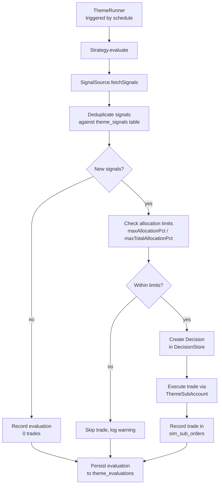
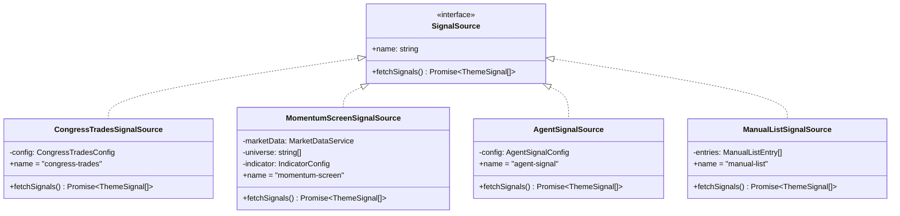
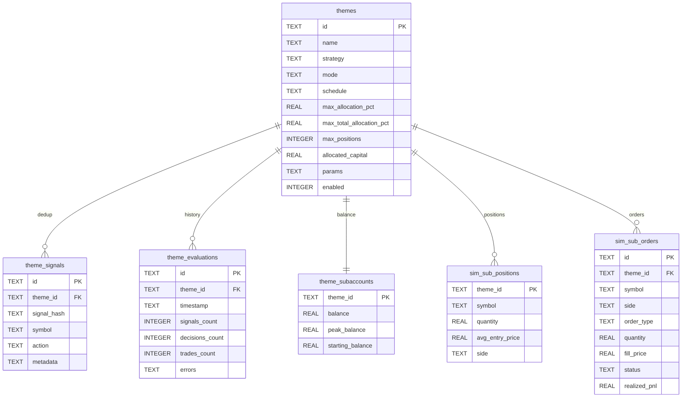

# Themes Framework

> Automated strategy framework for DoomTrade. Themes package a signal source, allocation rules, entry/exit criteria, and a schedule into a reusable automated trading strategy.

## Overview

The Themes Framework enables autonomous trading strategies that run on a schedule, generate signals from external sources, create trading decisions, and execute trades through independent sub-account portfolios — all without manual intervention.



## Core Concepts

### Theme

A configurable automated strategy. Stored in the `themes` table.

```typescript
interface ThemeConfig {
  id: string;
  name: string;
  strategy: string;           // Strategy type name
  mode: "sim" | "live";
  schedule: {
    type: "cron" | "interval" | "manual";
    expression?: string;       // Cron expression (for type: "cron")
    milliseconds?: number;     // Interval in ms (for type: "interval")
  };
  maxAllocationPct: number;    // Max allocation per position (default 5)
  maxTotalAllocationPct: number; // Max total allocation (default 40)
  maxPositions: number;        // Max concurrent positions (default 10)
  allocatedCapital: number;    // Starting capital (default 0)
  params: Record<string, unknown>; // Strategy-specific parameters
  enabled: boolean;
}
```

### ThemeSignal

A trading signal generated by a signal source.

```typescript
interface ThemeSignal {
  symbol: string;
  action: "buy" | "sell" | "hold";
  reason: string;
  suggestedQuantity?: number;
  metadata?: Record<string, unknown>;
}
```

### ThemeEvaluationResult

The outcome of a single evaluation cycle.

```typescript
interface ThemeEvaluationResult {
  themeId: string;
  timestamp: string;
  signals: ThemeSignal[];
  decisions: Decision[];
  trades: TradeRecord[];
  errors: string[];
}
```

## Architecture

### ThemeRunner (`src/themes/theme-runner.ts`)

Manages theme lifecycle and scheduling.

- **`registerStrategy(strategy)`**: Register a strategy implementation. Must be called before `startAll()`.
- **`startAll()`**: Start all enabled themes on boot. Resolves schedules and begins evaluation cycles.
- **`evaluateOnce(themeId)`**: Manually trigger a single evaluation cycle for a theme.
- **`stopAll()`**: Stop all running themes (clears timers). Called on SIGTERM.
- **Scheduling**: Uses `node-cron` for cron schedules, `setInterval` for interval schedules. Manual themes only run on explicit `evaluateOnce()` calls.

### ThemeStore (`src/themes/theme-store.ts`)

Database persistence for themes, signals, and evaluations.

- **Theme CRUD**: `create()`, `getById()`, `list()`, `update()`, `delete()`
- **Signal deduplication**: `recordSignal()` stores signals with a `signal_hash` in `theme_signals` table. `UNIQUE(theme_id, signal_hash)` prevents duplicate processing.
- **Evaluation history**: `recordEvaluation()` persists evaluation results to `theme_evaluations`. `listEvaluations()` retrieves history.

### ThemeSubAccount (`src/themes/theme-sub-account.ts`)

Independent paper trading portfolio per theme.

- **Balance**: Stored in `theme_subaccounts` table (balance, peak_balance, starting_balance)
- **Positions**: Stored in `sim_sub_positions` table (per-theme, per-symbol)
- **Orders**: Stored in `sim_sub_orders` table with realized P&L
- **Methods**: `placeOrder()`, `getBalance()`, `getPositions()`, `getTrades()`
- **Long-only**: No short selling (same as SimulatedExchange)

### AllocationCheck (`src/themes/allocation-check.ts`)

Enforces allocation limits before placing trades.

```typescript
function isWithinAllocationLimit(
  orderNotional: number,
  currentBalance: number,
  maxAllocationPct: number,    // Per-position limit (e.g. 5%)
  totalAllocated: number,
  maxTotalAllocationPct: number, // Total limit (e.g. 40%)
): { withinLimit: boolean; reason?: string }
```

## Strategy Interface

```typescript
interface ThemeStrategy {
  type: string;
  evaluate(ctx: ThemeContext, config: ThemeConfig): Promise<ThemeEvaluationResult>;
}

interface ThemeContext {
  db: Database;
  decisionStore: DecisionStore;
  tradeEngine: TradeEngine;
  portfolio: Portfolio;
  marketData: MarketDataService;
}
```

## Signal Source Interface

```typescript
interface SignalSource {
  name: string;
  fetchSignals(): Promise<ThemeSignal[]>;
}
```



## Built-in Strategies

### 1. CongressFollower (`src/themes/strategies/congress-follower.ts`)

Mirrors stock trades made by a specific US politician using the Bargo Congress Trades API.

- **Strategy type**: `"congress-follower"`
- **Signal source**: CongressTradesSignalSource (Bargo API — free, no key required, 30 req/day)
- **API**: `https://www.bargo.ai/free-apis/congress/v1`

**Parameters**
| Param | Type | Required | Description |
| --- | --- | --- | --- |
| politician | string | yes | Politician name (partial match, case-insensitive) |
| mirrorAction | "buys-only" \| "all" | no | Which trades to mirror (default: "buys-only") |
| apiKey | string | no | Bargo API key (raises rate limits) |

**Signal mapping**: `purchase` → buy, `sale`/`sale_full`/`sale_partial` → sell, `exchange` → hold (skip)

**Flow**: Fetch signals from Bargo API → deduplicate against `theme_signals` → filter by mirrorAction → check allocation limits → create Decisions → execute via sub-account

**Example**
```bash
curl -X POST http://localhost:3000/api/themes \
  -H "Content-Type: application/json" \
  -H "Authorization: Bearer YOUR_API_KEY" \
  -d '{
    "name": "Pelosi Tracker",
    "strategy": "congress-follower",
    "mode": "sim",
    "schedule": {"type": "interval", "milliseconds": 3600000},
    "params": {"politician": "Pelosi", "mirrorAction": "buys-only"},
    "enabled": true
  }'
```

### 2. MomentumRotation (`src/themes/strategies/momentum-rotation.ts`)

Screens a universe of symbols for momentum signals, selects top-N, equal-weights, and rotates.

- **Strategy type**: `"momentum-rotation"`
- **Signal source**: Pulls bar data from MarketDataService, computes indicators locally

**Parameters**
| Param | Type | Required | Description |
| --- | --- | --- | --- |
| universe | string[] | yes | Symbols to screen |
| indicator | IndicatorConfig | yes | Indicator configuration |
| topN | number | no | Top buy signals to hold (default 5) |
| timeframe | Timeframe | no | Bar timeframe (default "1Day") |
| range | string | no | Bar range (default "6m") |

**Indicator Config**
```typescript
// SMA crossover
{ type: "sma-crossover", periods: { fast: 20, slow: 50 } }

// RSI
{ type: "rsi", period: 14, oversold: 30, overbought: 70 }

// Combined (both must agree)
{ type: "combined", periods: { fast: 20, slow: 50 }, rsiPeriod: 14, oversold: 30, overbought: 70 }
```

**Signal logic**:
- **sma-crossover**: Golden cross (fast above slow) → buy, death cross (fast below slow) → sell
- **rsi**: RSI < oversold → buy, RSI > overbought → sell
- **combined**: Buy when both agree on buy, sell when both agree on sell, hold otherwise

**Rotation**: Selects top-N symbols with buy signals, equal-weights, sells positions that dropped from the top set.

**Example**
```bash
curl -X POST http://localhost:3000/api/themes \
  -H "Content-Type: application/json" \
  -H "Authorization: Bearer YOUR_API_KEY" \
  -d '{
    "name": "Crypto Momentum Top 5",
    "strategy": "momentum-rotation",
    "mode": "sim",
    "schedule": {"type": "cron", "expression": "0 9 * * *"},
    "params": {
      "universe": ["BTC/USDT", "ETH/USDT", "SOL/USDT", "XRP/USDT", "ADA/USDT", "DOGE/USDT", "AVAX/USDT"],
      "indicator": {"type": "sma-crossover", "periods": {"fast": 20, "slow": 50}},
      "topN": 5
    },
    "enabled": true
  }'
```

### 3. AgentDriven (`src/themes/strategies/agent-driven.ts`)

Delegates signal generation to an AI agent via A2A protocol.

- **Strategy type**: `"agent-driven"`
- **Signal source**: AgentSignalSource (A2A via `@cwdcwd/agent-bridge`)

**Parameters**
| Param | Type | Required | Description |
| --- | --- | --- | --- |
| agentEndpoint | string | yes | A2A endpoint URL for the agent |
| agentName | string | yes | Name of the agent to query |
| agentToken | string | no | A2A bearer token |
| universe | string[] | no | Symbol universe to constrain the agent |
| promptTemplate | string | no | Custom prompt template |

**Flow**: Get sub-account balance/positions → build prompt with equity, positions, universe → send to agent via A2A → parse JSON response as ThemeSignals → create decisions → execute via sub-account

**Default prompt**: "You are a trading strategy agent. Based on the current portfolio state below, recommend buy/sell/hold actions for symbols. Current equity: {equity}. Current positions: {positions}. Symbol universe: {universe}. Respond as a JSON array of objects with fields: symbol, action (buy|sell|hold), reason, suggestedQuantity (optional)."

**Example**
```bash
curl -X POST http://localhost:3000/api/themes \
  -H "Content-Type: application/json" \
  -H "Authorization: Bearer YOUR_API_KEY" \
  -d '{
    "name": "ThanosBot AI Strategy",
    "strategy": "agent-driven",
    "mode": "sim",
    "schedule": {"type": "interval", "milliseconds": 60000},
    "params": {
      "agentEndpoint": "https://ai.lan/a2a/thanosbot",
      "agentName": "ThanosBot",
      "agentToken": "secret-token",
      "universe": ["BTC/USDT", "ETH/USDT", "SOL/USDT"]
    },
    "enabled": true
  }'
```

## Signal Sources

### CongressTradesSignalSource (`src/themes/sources/congress-trades.ts`)

Fetches congressional trade disclosures from Bargo API.

- **Config**: `member`, `ticker`, `chamber`, `type`, `limit`, `apiKey`
- **Free tier**: 30 requests/day, 100 rows per request, no key required
- **Mapping**: purchase → buy, sale/sale_full/sale_partial → sell, exchange → hold (skip)

### MomentumScreenSignalSource (`src/themes/sources/momentum-screen.ts`)

Screens symbols for momentum using technical indicators.

- **Config**: `universe`, `indicator` (sma-crossover | rsi | combined), `timeframe`, `range`
- **Pulls bar data** from MarketDataService, computes indicators locally
- **Signal logic**: same as MomentumRotation strategy

### AgentSignalSource (`src/themes/sources/agent-signal.ts`)

Delegates to an AI agent via A2A.

- **Config**: `endpoint`, `token`, `agentName`, `getPositions()`, `getEquity()`, `universe`, `promptTemplate`
- **Uses `@cwdcwd/agent-bridge`** A2AClient for communication
- **Parses JSON response** as `[{symbol, action, reason, suggestedQuantity}]`
- **Error handling**: Throws with response context if JSON parsing fails

### ManualListSignalSource (`src/themes/sources/manual-list.ts`)

Static list of signals. Simplest source — for testing and buy-and-hold themes.

- **Config**: Array of `{symbol, action, reason, suggestedQuantity?}`
- **Returns**: Same list every time (no external API calls)

## Database Tables



## Writing a Custom Strategy

```typescript
import type { ThemeStrategy, ThemeContext } from "../strategy.js";
import type { ThemeConfig, ThemeEvaluationResult } from "../theme.js";

export class MyCustomStrategy implements ThemeStrategy {
  readonly type = "my-custom";

  async evaluate(
    ctx: ThemeContext,
    config: ThemeConfig,
  ): Promise<ThemeEvaluationResult> {
    const timestamp = new Date().toISOString();
    const errors: string[] = [];
    const params = config.params as { /* your param types */ };

    // 1. Generate signals (from any source)
    const signals = [...];

    // 2. Deduplicate against theme_signals table
    const { ThemeStore } = await import("../theme-store.js");
    const store = new ThemeStore(ctx.db);

    // 3. Check allocation limits
    const { isWithinAllocationLimit } = await import("../allocation-check.js");

    // 4. Create decisions and execute trades
    const decisions = [];
    const trades = [];

    // 5. Return result
    return {
      themeId: config.id,
      timestamp,
      signals,
      decisions,
      trades,
      errors,
    };
  }
}

// Register with ThemeRunner
themeRunner.registerStrategy(new MyCustomStrategy());
```